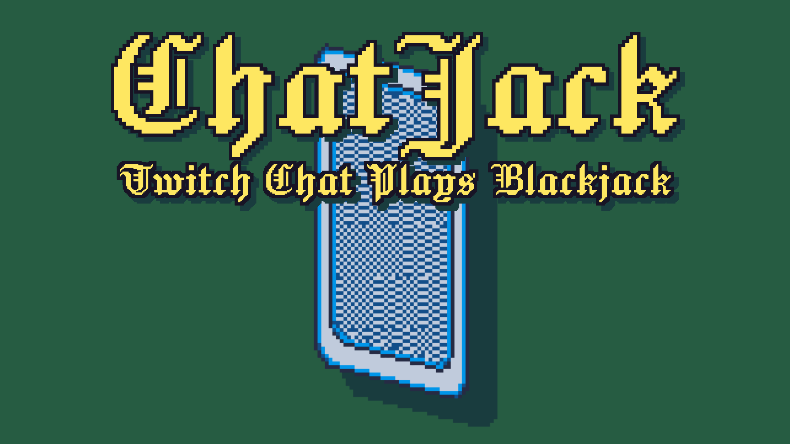

# ChatJack: Community-Powered Blackjack on Twitch



**ChatJack** is an interactive Twitch game that enables communities to play blackjack collaboratively through chat commands. Engage your viewers in a unified gaming experience where decisions are made collectively, fostering a sense of teamwork and excitement.

## Features

- **Community Voting**: Viewers vote on actions like `!hit` or `!stand`, making each game a shared experience.
- **No Monetary Stakes**: Enjoy the classic game of blackjack without any betting—purely for fun.
- **Twitch Integration**: Seamlessly connects with the Twitch API, allowing real-time interaction through chat commands.
- **Spectator and Moderator Modes**:
  - _Spectator Mode_: Display the game on stream using OBS tools like Pogly, enhancing viewer engagement.
  - _Moderator Mode_: Broadcasters or moderators can control game settings and flow directly from their browser.
- **AI Dealer**: After the community's turn, the AI dealer reveals its hole card and completes its turn, adding suspense to each round.
- **Customizable Settings**: Tailor the game experience by adjusting vote durations, frame rates, number of decks, and more.

## Upcoming Features

- **Twitch Channel Predictions Integration**: Enable viewers to wager channel points on game outcomes, increasing engagement.
- **Chat Bot Announcements**: Automated messages to guide players, such as "Type `!start` to begin!"

## Installation

1. **Clone the Repository**:
   ```bash
   git clone https://github.com/yourusername/chatjack.git
   ```
2. **Navigate to the Project Directory**:

   ```bash
   cd chatjack
   ```

3. **Dependencies:**

   ```bash
   pnpm install
   ```

4. **Set Up Environment Variables**:

- Create a .env.local file in the root directory.
- Add your Twitch credentials and other necessary configurations:
  ```bash
  TWITCH_CLIENT_ID=your_client_id
  TWITCH_CLIENT_SECRET=your_client_secret
  TWITCH_BOT_USERNAME=your_bot_username
  TWITCH_BOT_TOKEN=your_bot_token
  # etc...
  ```

5. **Start the Application**:

   ```bash
   pnpm dev
   ```

## Usage

1. Launch ChatJack: Ensure the application is running on your server.

2. Integrate with OBS:

   - Add a Browser Source in OBS.
   - Set the URL to http://localhost:3000/spectate/${channel} (or your server's URL).
   - Adjust the dimensions to fit your stream layout.

3. Moderate the Game:

   - Access the moderator interface at http://localhost:3000/play/${channel}/${channel_id}?debug.
   - Use the controls to start games, adjust settings, and monitor chat interactions.

4. Viewer Participation:

   - Viewers participate by typing commands like !hit or !stand in the chat during their turn.
   - The game processes votes and displays the results in real-time.

## Contributing

We welcome contributions from the community! To get involved:

1. **Fork the Repository**: Click the "Fork" button at the top right of this page.

2. **Create a New Branch**: Use a descriptive name for your branch.

   ```bash
   git checkout -b feature/your-feature-name
   ```

3. **Make Your Changes**: Implement your feature or fix.

4. **Commit Your Changes**: Write clear and concise commit messages.

   ```bash
   git commit -m "Add feature: your feature name"
   ```

5. **Push to Your Fork**:

   ```bash
   git push origin feature/your-feature-name
   ```

6. **Submit a Pull Request**: Navigate to the original repository and click "New Pull Request."

Please ensure your code adheres to our coding standards and includes appropriate tests.

License

This project is licensed under the MIT License. See the LICENSE file for details.
