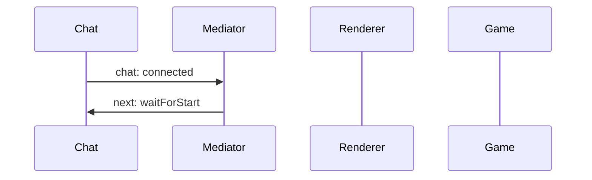
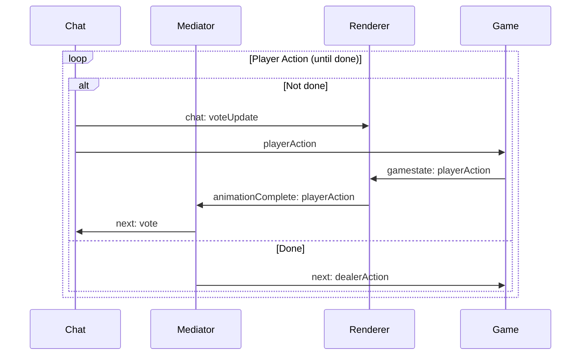
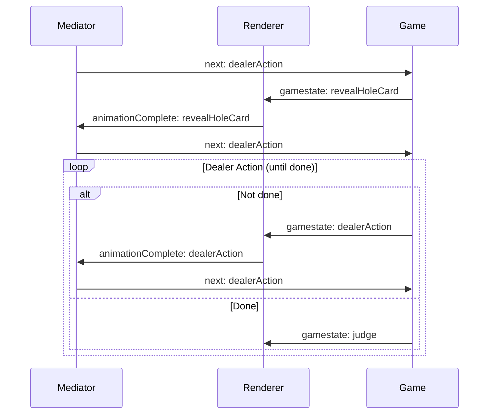
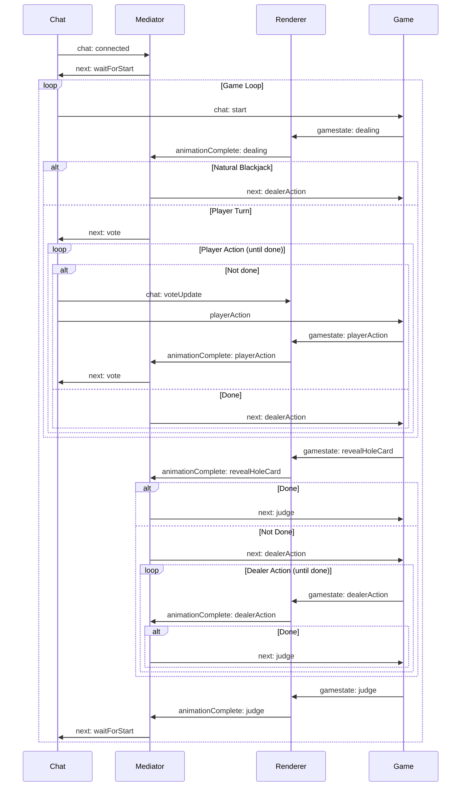

### Init

```mermaid
sequenceDiagram
    participant C as Chat
    participant M as Mediator
    participant R as Renderer
    participant G as Game

    %% Init
    C->>M: chat: connected
    M->>C: next: waitForStart
```

### Player Turn

```mermaid
sequenceDiagram
    participant C as Chat
    participant M as Mediator
    participant R as Renderer
    participant G as Game

    loop Player Action (until done)
        %% Decision: is Player done?
        alt Not done
            %% Voting Phase
            C->>R: chat: voteUpdate
            C->>G: playerAction

            %% Action Animation
            G->>R: gamestate: playerAction
            R->>M: animationComplete: playerAction
            M->>C: next: vote
        else Done
            M->>G: next: dealerAction
        end
    end
```

### Dealer Turn

```mermaid
sequenceDiagram
    %% participant C as Chat
    participant M as Mediator
    participant R as Renderer
    participant G as Game

    M->>G: next: dealerAction

    %% Dealer Turn Phase
    G->>R: gamestate: revealHoleCard
    R->>M: animationComplete: revealHoleCard
    M->>G: next: dealerAction

    loop Dealer Action (until done)
        %% Decision is Dealer done?
        alt Not done
            G->>R: gamestate: dealerAction
            R->>M: animationComplete: dealerAction
            M->>G: next: dealerAction
        else Done
            G->>R: gamestate: judge
        end
    end

```

### Full Sequence

```mermaid
sequenceDiagram
    participant C as Chat
    participant M as Mediator
    participant R as Renderer
    participant G as Game

    %% Init
    C->>M: chat: connected
    M->>C: next: waitForStart

    loop Game Loop
        %% Start Phase
        C->>G: chat: start

        %% Dealing Phase
        G->>R: gamestate: dealing
        R->>M: animationComplete: dealing

        %% Decision: Natural Blackjack?
        alt Natural Blackjack
            M->>G: next: dealerAction
        else Player Turn
            M->>C: next: vote

            loop Player Action (until done)
                %% Decision: Player done?
                alt Not done
                    %% Voting Phase
                    C->>R: chat: voteUpdate
                    C->>G: playerAction

                    %% Action Animation
                    G->>R: gamestate: playerAction
                    R->>M: animationComplete: playerAction
                    M->>C: next: vote
                else Done
                    M->>G: next: dealerAction
                end
            end
        end


        %% Dealer Turn Phase
        G->>R: gamestate: revealHoleCard
        R->>M: animationComplete: revealHoleCard

        %% Decision: Dealer done?
        alt Done
            M->>G: next: judge
        else Not Done
            M->>G: next: dealerAction

            loop Dealer Action (until done)
                G->>R: gamestate: dealerAction
                R->>M: animationComplete: dealerAction

                %% Decision is Dealer done?
                alt Done
                    M->>G: next: judge
                end
            end
        end

        %% Outcome Phase
        G->>R: gamestate: judge
        R->>M: animationComplete: judge
        M->>C: next: waitForStart
    end
```

